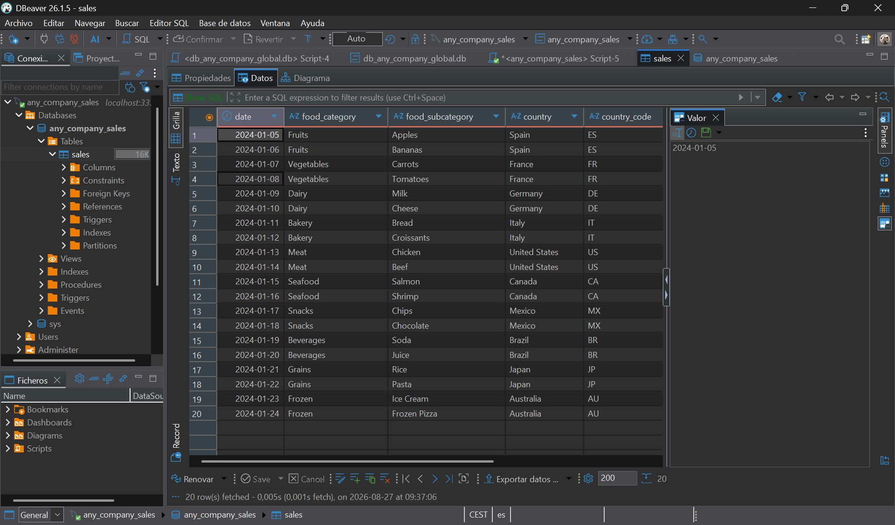
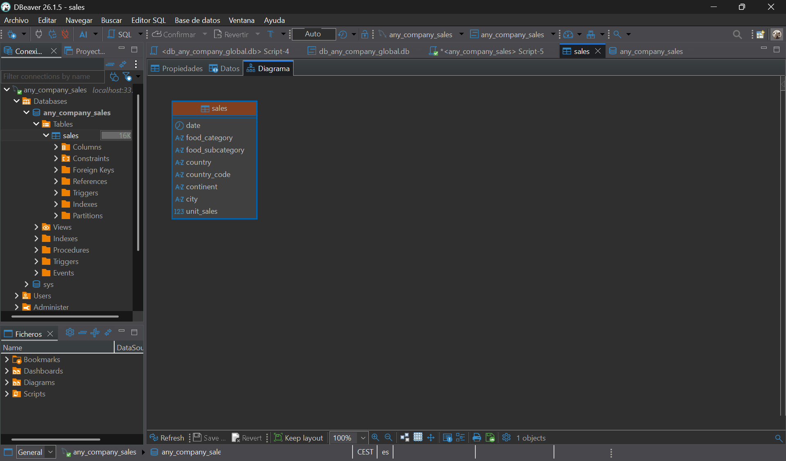
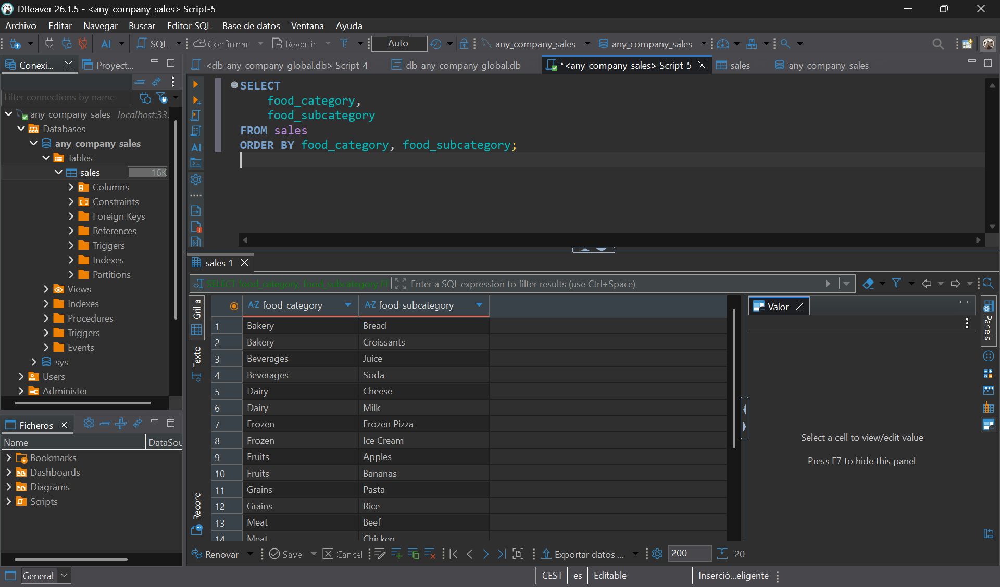
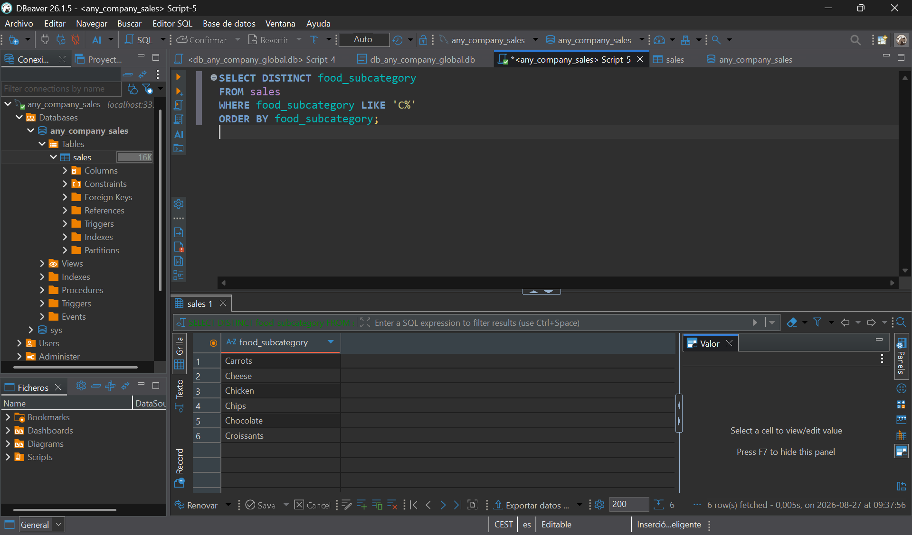
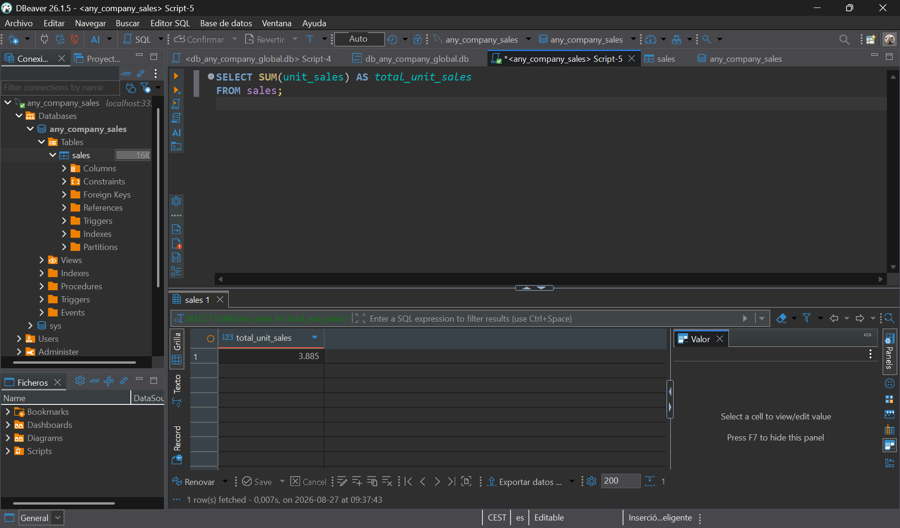
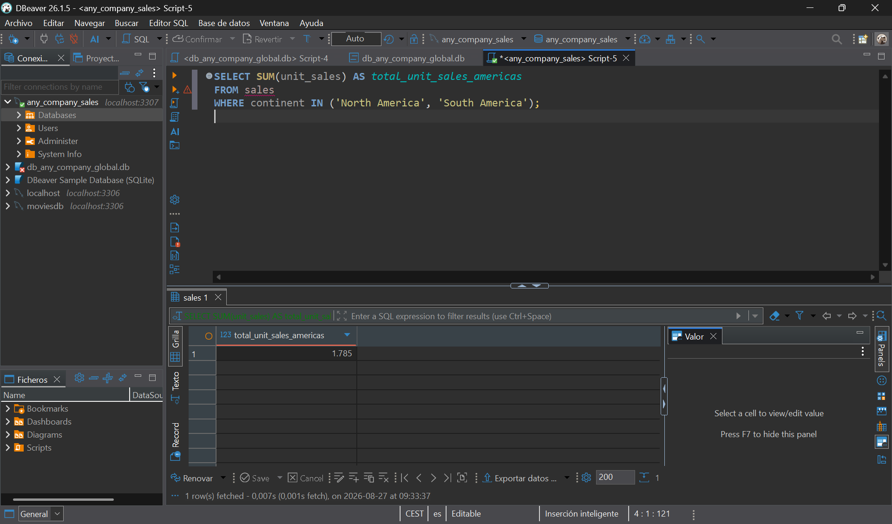

# 🌍 Any Company Sales — Consultas SQL en MySQL (Docker)

> Ejercicio de consultas SQL sobre una tabla de ventas (`sales`), con MySQL corriendo en un contenedor Docker.

> 🎓 Trabajo realizado para el **Bootcamp de [Factoria F5](https://factoriaf5.org/)**.

---

## 📋 Descripción

El punto de partida es una única tabla `sales` con 20 registros de ventas de
distintos países y categorías de producto, proporcionada por el profesor
(estructura y datos sin modificar). El objetivo es levantar una base de
datos **MySQL en Docker**, cargar esa tabla y escribir 4 scripts SQL que
respondan a preguntas concretas sobre los datos:

1. Categoría y subcategoría de producto de cada venta.
2. Qué subcategorías empiezan por la letra `C`.
3. El total de unidades vendidas (todas las ventas).
4. El total de unidades vendidas en el continente americano.

---

## 🗂️ Tabla de partida

```sql
CREATE TABLE sales (
    date DATE,
    food_category VARCHAR(50),
    food_subcategory VARCHAR(50),
    country VARCHAR(50),
    country_code CHAR(2),
    continent VARCHAR(20),
    city VARCHAR(50),
    unit_sales INT
);
```

20 filas, con ventas en Europa, Norteamérica, Sudamérica, Asia y Oceanía.
Ver [`sql/01_create_and_insert_sales.sql`](sql/01_create_and_insert_sales.sql)
para el detalle completo — estos datos son el enunciado del ejercicio y no
se tocan en ningún script posterior.

**Datos cargados en la tabla `sales`:**



**Diagrama de la tabla `sales`:**



---

## 🧱 Scripts SQL

| Script                                                                                   | Requisito del enunciado                                    | Resultado                    |
| ------------------------------------------------------------------------------------------ | ------------------------------------------------------------ | ------------------------------ |
| [`01_create_and_insert_sales.sql`](sql/01_create_and_insert_sales.sql)                   | Crear la tabla `sales` y cargar los datos de partida          | —                             |
| [`02_food_category_and_subcategory.sql`](sql/02_food_category_and_subcategory.sql)       | **Script SQL 1** — todos los datos de categoría y subcategoría | 20 filas (`food_category`, `food_subcategory`) |
| [`03_subcategories_starting_with_c.sql`](sql/03_subcategories_starting_with_c.sql)       | **Script SQL 2** — subcategorías que empiezan por "C"          | `Carrots, Cheese, Chicken, Chips, Chocolate, Croissants` |
| [`04_total_units_sold.sql`](sql/04_total_units_sold.sql)                                 | **Script SQL 3** — total de unidades vendidas                 | `3885`                        |
| [`05_total_units_american_continent.sql`](sql/05_total_units_american_continent.sql)     | **Script SQL 4** — total de unidades del continente americano  | `1785`                        |

### Resultados en DBeaver

**Script 1 — Categoría y subcategoría** ([`02_food_category_and_subcategory.sql`](sql/02_food_category_and_subcategory.sql))



**Script 2 — Subcategorías que empiezan por "C"** ([`03_subcategories_starting_with_c.sql`](sql/03_subcategories_starting_with_c.sql))



**Script 3 — Total de unidades vendidas** ([`04_total_units_sold.sql`](sql/04_total_units_sold.sql))



**Script 4 — Total de unidades en el continente americano** ([`05_total_units_american_continent.sql`](sql/05_total_units_american_continent.sql))



### Sobre el script 4 (continente americano)

Los datos usan el modelo de "7 continentes" y guardan por separado
`North America` y `South America`. Como el enunciado habla del
**continente americano** en singular (el criterio geográfico habitual en
castellano, que engloba todo el continente de norte a sur), el script suma
ambos:

```sql
SELECT SUM(unit_sales) AS total_unit_sales_americas
FROM sales
WHERE continent IN ('North America', 'South America');
```

Eso da `1785` (1285 de Norteamérica + 500 de Sudamérica). Si el criterio de
corrección esperase solo `North America`, el resultado sería `1285` —
basta con quitar `'South America'` de la lista.

---

## 🐳 Cómo levantar MySQL en Docker

Todo el setup está en [`docker/docker-compose.yml`](docker/docker-compose.yml).

### Requisitos previos

- **[Docker Desktop](https://www.docker.com/products/docker-desktop/)** instalado y en marcha.
- **[DBeaver](https://dbeaver.io/download/)** (o el cliente MySQL que prefieras) para ejecutar los scripts.

### Pasos

1. **Levantar el contenedor:**

   ```bash
   cd docker
   docker compose up -d
   ```

   Esto crea un contenedor MySQL 8 llamado `mysql_any_company_sales`, con
   la base de datos `any_company_sales` ya creada vacía, expuesto en el
   puerto `3306` de tu máquina.

   Alternativa sin `docker-compose.yml`, con `docker run` directo:

   ```bash
   docker run --name mysql_any_company_sales \
     -e MYSQL_ROOT_PASSWORD=rootpassword \
     -e MYSQL_DATABASE=any_company_sales \
     -p 3306:3306 \
     -d mysql:8.0
   ```

2. **Conectar DBeaver:** `Database` → `New Database Connection` → **MySQL**:
   - Host: `localhost`
   - Port: `3306`
   - Database: `any_company_sales`
   - Username: `root`
   - Password: `rootpassword`

   La primera vez te pedirá descargar el driver de MySQL — acepta.

3. **Ejecutar los scripts en orden**, abriéndolos en el editor SQL de
   DBeaver (`SQL Editor` → `New SQL Script`) y ejecutando cada uno completo
   (`Alt+X`): `01` → `02` → `03` → `04` → `05`.

4. **Parar el contenedor** cuando termines (los datos persisten en el
   volumen `mysql_data`, así que puedes volver a arrancarlo sin perder
   nada):

   ```bash
   docker compose down
   ```

---

## 📁 Estructura del repositorio

```text
sales-queries/
├── docker/
│   └── docker-compose.yml
├── img/
│   ├── databasesales.png
│   ├── diagramsales.png
│   ├── script2sales.png
│   ├── script3sales.png
│   ├── script4sales.png
│   └── script5sales.png
├── sql/
│   ├── 01_create_and_insert_sales.sql
│   ├── 02_food_category_and_subcategory.sql
│   ├── 03_subcategories_starting_with_c.sql
│   ├── 04_total_units_sold.sql
│   └── 05_total_units_american_continent.sql
└── README.md
```

---

## 🛠️ Tecnologías

- **[MySQL 8](https://www.mysql.com/)** — motor de base de datos.
- **[Docker](https://www.docker.com/)** / **Docker Compose** — para levantar MySQL sin instalarlo en local.
- **[DBeaver](https://dbeaver.io/)** — cliente usado para ejecutar los scripts.
- **Git / GitHub** — control de versiones y alojamiento del proyecto.

---

## ✍️ Autor

**[@ikerardi-dev](https://github.com/ikerardi-dev)**
